# Episode 주요 유저 플로우 차트

## 📋 목차

1. [신규 사용자 플로우](#1-신규-사용자-플로우)
2. [기존 사용자 플로우](#2-기존-사용자-플로우)
3. [공백 진단 플로우](#3-공백-진단-플로우)
4. [공유 링크 접근 플로우](#4-공유-링크-접근-플로우)
5. [에피소드 보관함 플로우](#5-에피소드-보관함-플로우)
6. [STAR 작성 플로우](#6-star-작성-플로우)
7. [팀 마인드맵 협업 플로우](#7-팀-마인드맵-협업-플로우)
8. [프로젝트 관리 플로우](#8-프로젝트-관리-플로우)

---

## 1. 신규 사용자 플로우

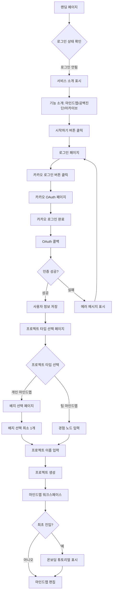

---

## 2. 기존 사용자 플로우

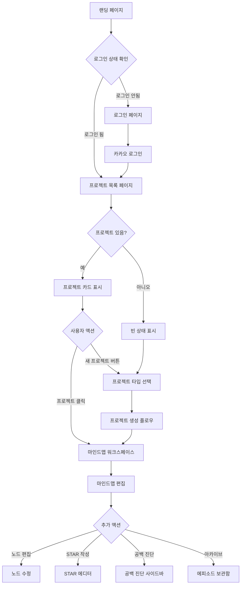

---

## 3. 공백 진단 플로우

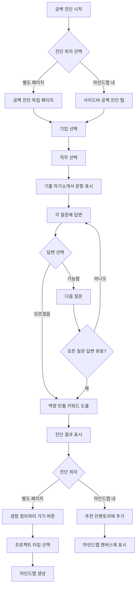

---

## 4. 공유 링크 접근 플로우

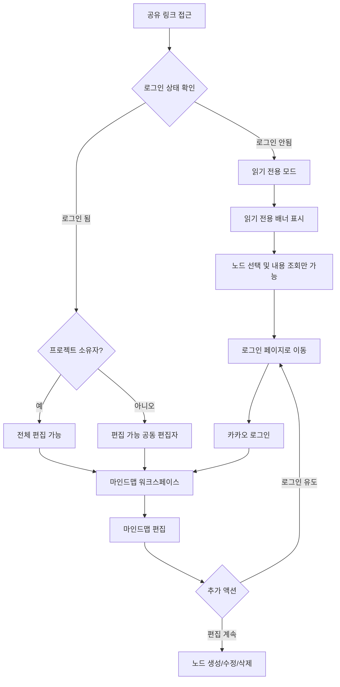

---

## 5. 에피소드 보관함 플로우

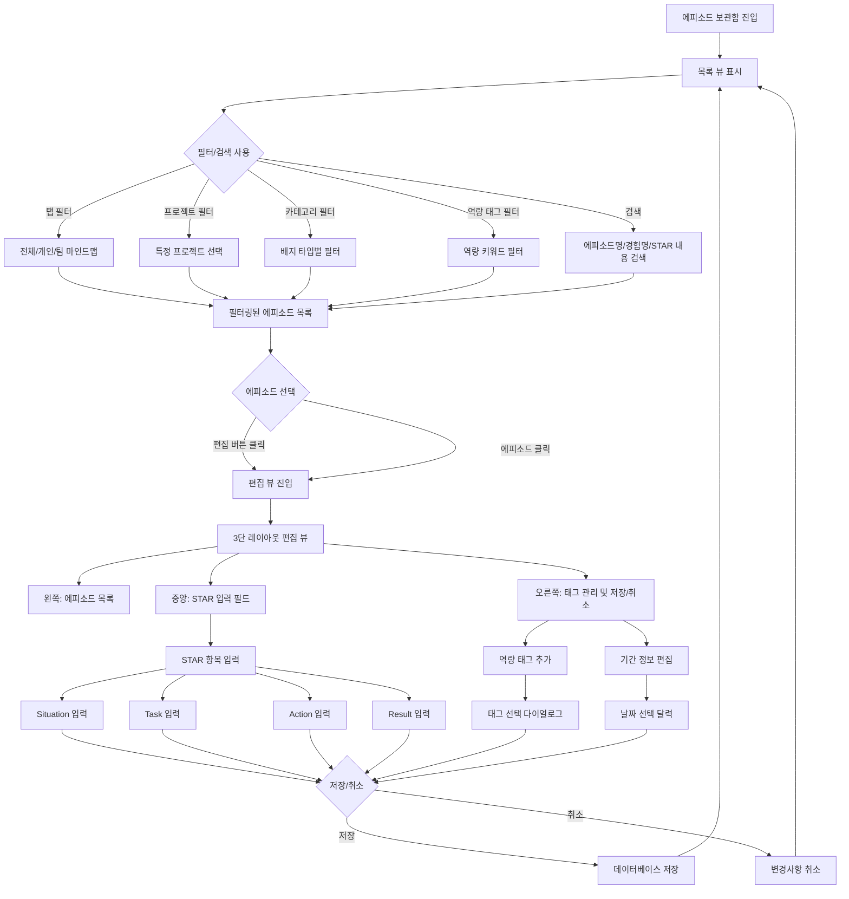

---

## 6. STAR 작성 플로우

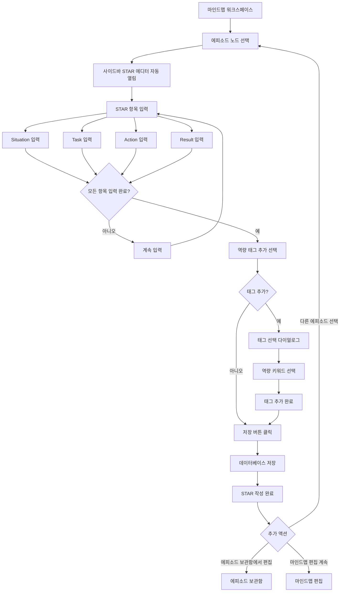

---

## 7. 팀 마인드맵 협업 플로우

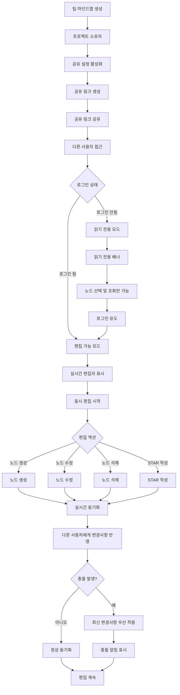

---

## 8. 프로젝트 관리 플로우

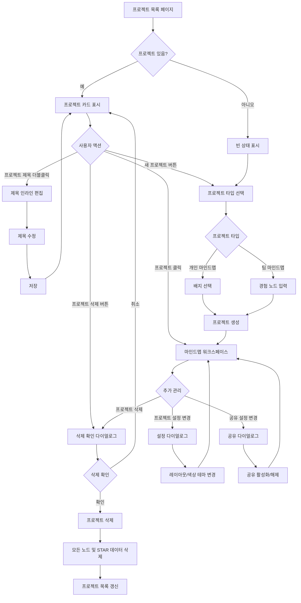

---

## 9. 노드 관리 플로우

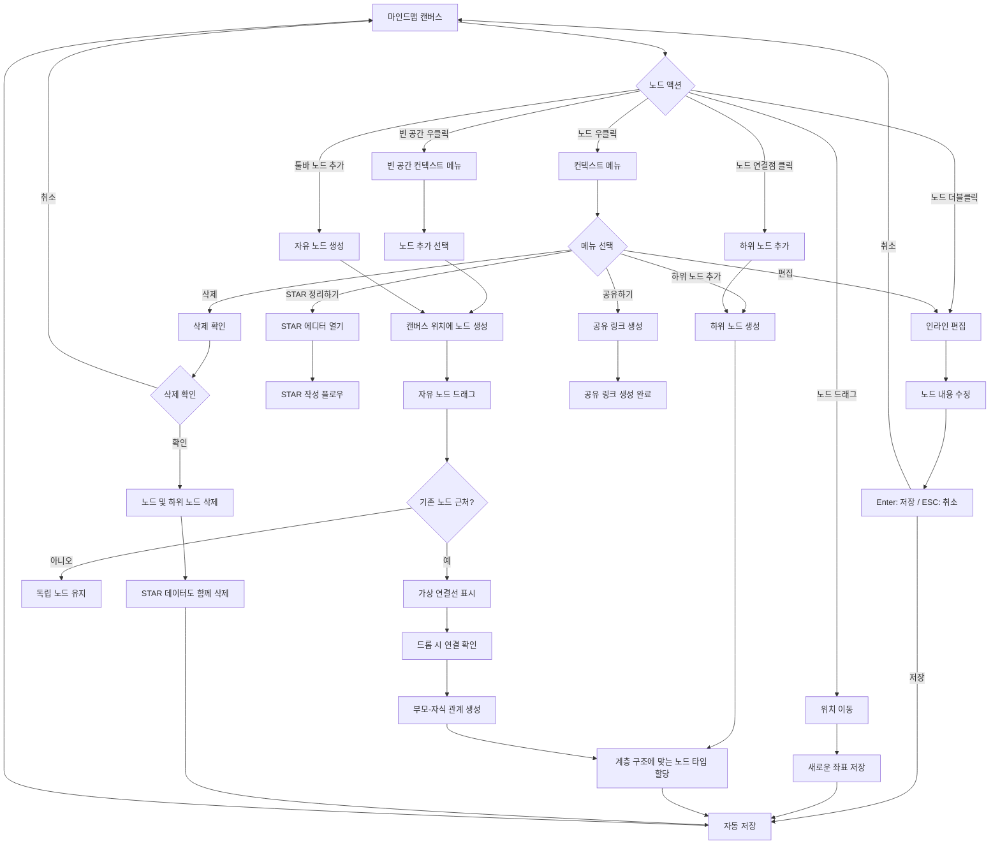

---

## 10. 검색 및 필터 플로우

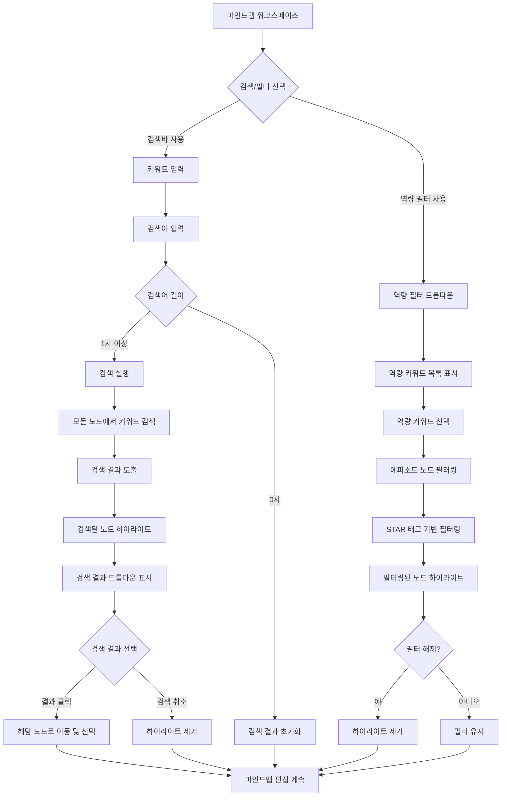

---

## 11. 탭 관리 플로우

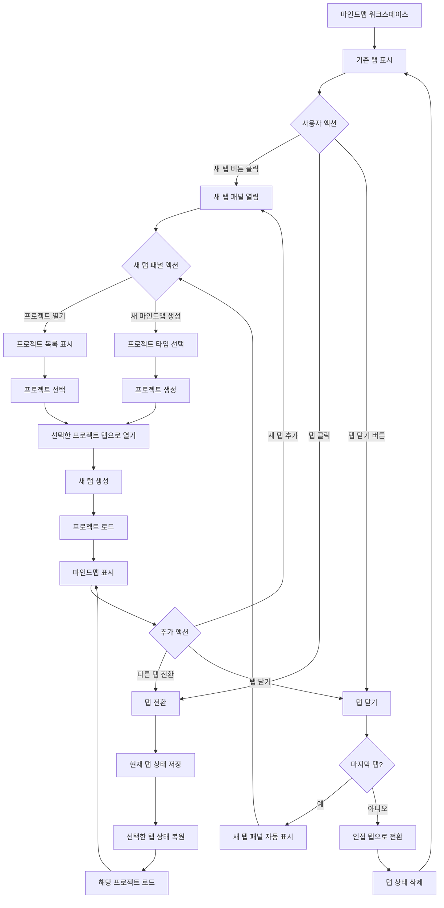

---

## 12. 내보내기 플로우

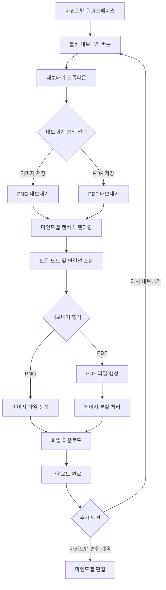

---

## 플로우 차트 사용 가이드

### 차트 읽는 방법
- **사각형**: 페이지 또는 화면
- **다이아몬드**: 조건 분기 (예/아니오 결정)
- **화살표**: 사용자 액션 또는 시스템 흐름
- **라운드 사각형**: 프로세스 또는 액션

### 주요 플로우 요약

1. **신규 사용자**: 랜딩 → 로그인 → 프로젝트 타입 선택 → 배지 선택 → 마인드맵 생성
2. **기존 사용자**: 랜딩 → 프로젝트 목록 → 마인드맵 편집
3. **공백 진단**: 진단 시작 → 기업/직무 선택 → 질문 답변 → 결과 도출
4. **공유 링크**: 링크 접근 → 권한 확인 → 읽기/편집 모드
5. **에피소드 보관함**: 목록 조회 → 필터/검색 → 편집 뷰 → STAR 수정
6. **STAR 작성**: 에피소드 선택 → STAR 에디터 → 항목 입력 → 태그 추가 → 저장
7. **공동 협업**: 공유 활성화 → 링크 공유 → 동시 편집 → 실시간 동기화
8. **프로젝트 관리**: 목록 조회 → 생성/수정/삭제 → 설정 변경
9. **노드 관리**: 노드 생성/편집/삭제 → 계층 구조 관리
10. **검색/필터**: 키워드 검색 → 역량 필터 → 결과 하이라이트
11. **탭 관리**: 탭 생성/전환/닫기 → 상태 저장/복원
12. **내보내기**: 형식 선택 → 렌더링 → 파일 다운로드

---

**작성일**: 2024년 1월 1일  
**최종 수정일**: 2024년 1월 1일
